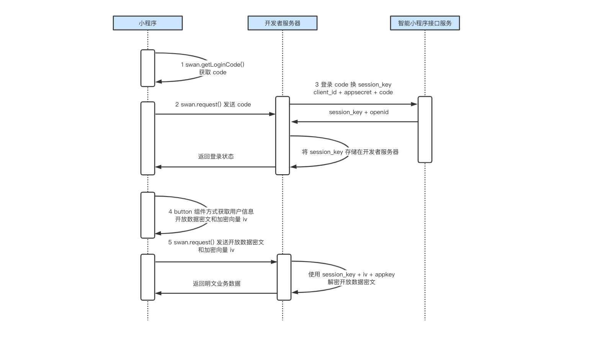

# 项目介绍

小程序登录授权及支付前端示例代码。

# 项目模块

## 登录示例

小程序登录授权的内部实现完整流程图见下图。

###   1. 手机号快捷登录（组件button）

* 调用该组件时，如果拿不到`iv`，说明用户授权拒绝
* 如果没有全局存下的`openID`，需要先拿到开发者服务端的`sessionKey`,以进行进一步的解密操作。具体操作是：先调用`swan.getLoginCode`拿到`code`，回传给服务端，服务端返回`openID`，详情见本例中`handlePhoneNumber`事件处理过程
*  如果可以拿到`iv`及`openID`，需要将`encryptedData`、`iv`及`openID`回传给服务端，供服务端解密。详情见本例中`requestPhoneNumber`事件处理过程
>   服务端的解密操作参见[`auth-demo-backend`登录授权服务端示例](https://github.com/baidu-smart-app/auth-demo-backend)的`/auto/login`及`/auth/phone`接口。

###   2. 获取用户信息（组件button）

获取用户数据时，会直接吊起登录面板，用户允许授权并且登录后，调用`/auth/login`接口，与服务端打通。将获取到的用户加密数据`encryptedData`、`iv`
`openID`，传给服务端`/auth/userinfo`接口，获取解密后的用户数据。详情见本例中`getUserData`事件处理过程

## 支付示例

支付示例展示了创建订单、查看订单详情、申请退款的流程。对应请求的接口为`/pay/gen`、`/pay/status`、`/pay/refund`。由于主要处理在服务端，这里就不再赘述，详细处理方法见[服务端示例](https://github.com/baidu-smart-app/auth-demo-backend)。

# 前端项目部署
1、执行`git clone https://github.com/baidu-smart-app/auth-pay-demo-frontend.git`克隆支付前端代码库 ，并使用`百度开发者工具打开` 
2、如果仅使用该`demo` 试用授权登录功能，可以参考[服务端示例](https://github.com/baidu-smart-app/auth-demo-backend)，部署本地调试环境 
3、如果需要应用到具体的业务需求中，建议自行搭建后端服务，并将`app.js`中配置的`host(http://127.0.0.1:8080)` 替换为自己的业务域名