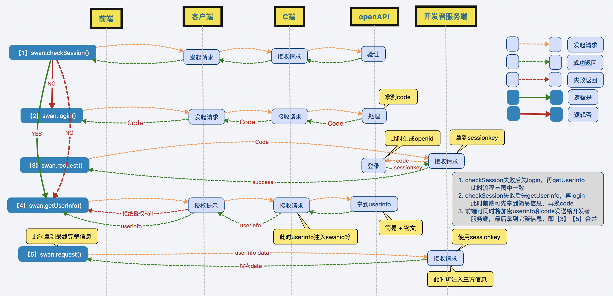

# 项目介绍

小程序登录授权及支付前端示例代码。

# 项目模块

## 登录示例

小程序登录授权的内部实现完整流程图见下图。

###   1. 手机号快捷登录（组件button）

* 调用该组件时，如果拿不到`iv`，说明用户授权拒绝；
* 如果没有全局存下的`openID`，需要先拿到开发者服务端的`sessionKey`,以进行进一步的解密操作。具体操作是：先调用`swan.login`拿到`code`，回传给服务端，服务端返回`openID`，详情见本例中`getPhoneNumber`事件处理过程；
*  如果可以拿到`iv`及`openID`，将`encryptedData`、`iv`及`openID`回传给服务端，供服务端解密。（`getPhoneNumber`回调返回的数据中，包含`encryptedData`及`iv`）。
>   服务端的解密操作参见[`auth-demo-backend`登录授权服务端示例](https://github.com/baidu-smart-app/auth-demo-backend)的`/auto/login`及`/auth/phone`接口。
>
>   注： 在手百未登录的情况下，第一次点击`button`会调用`login`, 同时会弹出返回`'auth fail denn'`。第二次点击才会弹出授权框，如果用户同意，才能正确返回`iv`及
`encryptedData`等相关数据。这是已知bug，正在修复中。

###   2. 弱用户体系获取用户数据

弱用户体系获取用户数据，是直接调用`swan.getUserInfo`的`API`。当用户没有登录或者没有同意授权时将给开发者mock数据供展示使用。当调用成功时，会返回`userInfo`。`userInfo`表示用户明文（非隐私）数据，可以当做UI元素展示，但不能用作用户体系打通。

###   3. 强用户体系获取用户数据

会竭尽全力的去拿用户数据。

会检查用户登录状态，提示用户授权。如果没有`openID`，需要先登录，然后调用`/auth/login`接口，与服务端打通。如果获取到`openID`，调用`/auth/userinfo`接口，获取解密后的用户数据。详细处理过程见代码`forceGetUserInfo`方法。

## 支付示例

支付示例展示了创建订单、查看订单详情、申请退款的流程。对应请求的接口为`/pay/gen`、`/pay/status`、`/pay/refund`。由于主要处理在服务端，这里就不再赘述，详细处理方法见[服务端示例](https://github.com/baidu-smart-app/auth-demo-backend)。
